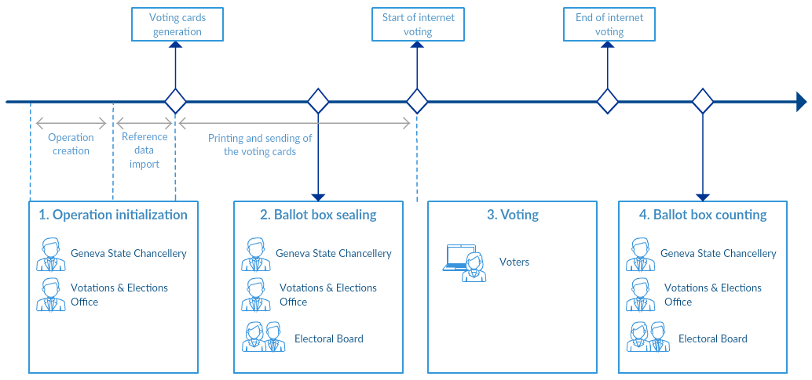
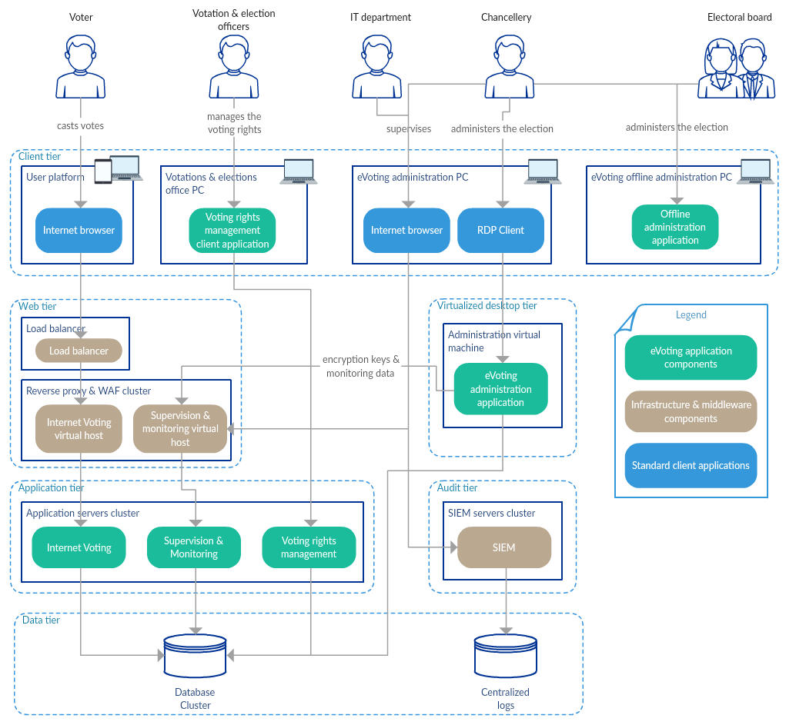
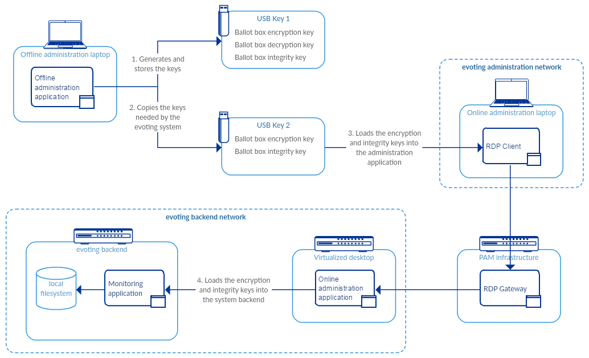
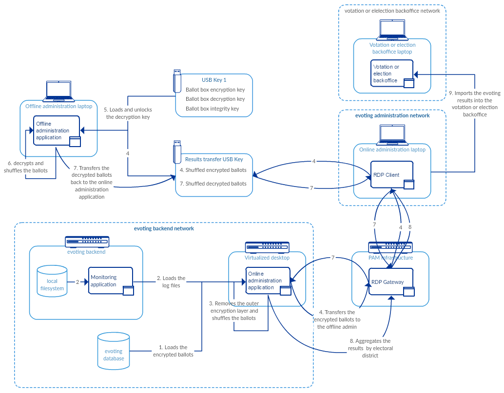
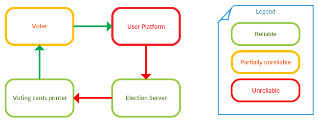

# System overview
## Legal compliance
CHVote complies to the swiss federal chancellery ordinance on Electronic Voting
([VEleS](https://www.bk.admin.ch/themen/pore/evoting/07979/index.html?lang=en)) for an evoting system offered up to
30% of the resident voters.

## The election process

### Phase 1. Operation initialization
During the initialization phase, the data necessary for the ballot is imported into the evoting system.
This data comes from several sources and are of different natures. In particular:
* The ballot description: subjects for a votation, rolls and candidates for an election
* The electoral affiliation data: municipalities and electoral districts
* The data necessary to generate the voting cards: population registry with names, addresses, voting place
* The data necessary to generate the authentication data: birth date

The nominative data coming from the population registry and used to generate the voting cards are never stored
in the evoting system database.

### Phase 2. Ballot box sealing
The ballot box sealing session is organized by the Geneva State Chancellery and includes the Electoral Board and members
of the Votations & Elections office. Its goal is to generate the cryptographic material used to seal the ballot box:
* A symmetric key used to check the integrity of the ballot box using an authenticated encryption with an
associated counter.
* An asymmetric key pair used to encrypt and decrypt the content of the ballot box. The private key used to decrypt 
the ballots is protected by a passphrase formed by the concatenation of two passphrases entered  by two subgroups of the
 Electoral Board.
 
The integrity key as well as the public encryption key are stored on a removable device and sent to the evoting system application servers. 

Once the keys are generated, tested offline and pushed into the system, control votes are entered into the system.
A tally of the control ballot box is then issued (this includes the ballot box decryption) to verify the validity of 
the cryptographic material on all the components of the system.
 
The complete cryptographic material - including the private key - stored on removable devices (USB keys, CD-ROM) 
are kept safe by a police officer.

The Electoral Board passphrases are kept stored on paper forms, themselves stored in sealed letters kept safe by 
a notary.
  
At last, the offline laptop is sealed in a bag until the ballot box counting session.

See [Focus on the key generation step](#focus-on-the-key-generation-step) for further detail on the data flow involving the
keys and the various components of the system.

### Phase 3. Voting
Once the ballot box is sealed, the internet voting channel can be opened. The voter starts her voting session by 
entering her voting card identifier.

The voter is presented some legal information, then she can compose her ballot.

Once settled, a summary of her choices  is displayed as well as an authentication form asking for a birth date.

Upon authentication, the system then shows the verification codes for each choice. The voter compares those codes
 to the ones printed on her voting cards, and can approve them by entering her personal confirmation code.

 The vote is finished once the finalisation code is displayed on the final page. This code is to be compared to the
 personal finalisation code printed on the voting card.

### Phase 4. Ballot box counting
The ballot box counting session is organized by the Geneva State Chancellery and includes the Electoral Board and members
of the Votations & Elections officers.

Its goal is to check the integrity of the ballot box, to shuffle and extract it from the online system, 
to export it to the offline administration application, to decrypt the ballots, and then to shuffle and export them back
to the online administration system in order to establish the votation or election results.

In order to decrypt the ballots, the two subgroups of the Electoral Board are asked to enter their respective
passphrases.

See [Focus on the ballot box decryption step](#focus-on-the-ballot-box-decryption-step) for further detail.

## Architecture overview
To understand the role of the offline administration application within the complete CHVote evoting system, please
consider the following system overview diagram.

From the user perspective, the system is composed of the following components:
* The voter user platform which can be any web browser on a PC, Mac or Tablet. CHVote is currently not aiming at
smartphones as a voting platform.
* The Voting rights management client application, which is used by the votations & elections officers from a private
network (Geneva Office) and from a VPN (for the other cantons offices). This application is used to record the usage of
the voting cards and to prevent a voter to use several voting channels (mail + internet for example) to input more than
one vote per voter.
* The Geneva State Chancellery uses a RDP client to connect to a virtualized desktop running the administration
application. The RDP channel allows to log all the actions made by the administrator by a privileged access 
management system, as well as enforcing 4 eyes access.
* The offline administration application is used by the Geneva State Chancellery and the Electoral Board to generate
the cryptographic material and to decrypt the ballots.
* The IT Department and the Geneva State Chancellery have access to a SIEM to monitor the security events and to
 follow business indicators (e.g. user agents used, number of votes distribution).
 
From a system perspective, the key properties are the following:
* The internet voting application is deployed in a clustered multi-site infrastructure. A load balancer acts as
the TLS endpoint and balances the sessions between the working nodes. A reverse-proxy whitelists URLs, applies specific filters to 
parameters and provides a standard WAF functionality.
* A supervision & monitoring application watches the health of the internet voting application and of the evoting 
database.
* All the logs from the reverse proxies, the internet voting application, the supervision & monitoring application and 
the voting rights management server are forwarded to the SIEM.
* The SIEM ensures that the received logs cannot be tampered with.

## Focus on the key generation step

### Step 1. Key generation and storage on a removable device
The offline administration application offers a use case that allows to generate the integrity and the ballot 
encryption key pair and to save them on a removeable device (USB key).

For the decryption private key to be generated, the application needs two passphrases to be entered by two
subgroups of the Electoral Board. The passphrases are concatenated to a unique passphrase used to seal
a PKCS#12 file containing the key pair.

A copy of the keys is copied to another removable device (CD-ROM).

In this step, a test is conducted using sequentially each removable devices (USB key then CD-ROM) to ensure that 
the keys and the passphrases are valid. 

### Step 2. Copy of the integrity and encryption keys to another removable device
The integrity key and the public ballots encryption key are copied from the USB Key 1 to the USB Key 2 using the offline
administration laptop. A copy of this USB key is also burned on a CD-ROM.
 
### Steps 3 and 4. Loading of the keys into the evoting system
The election officer plugs the USB Key 2 (the one not having the private decryption key) into the online administration
laptop.

He connects to the administration application running on a virtualized desktop, using a RDP client. The RDP stream is
securely logged by the PAM infrastructure. The logs are encrypted by a public key whose private key is known only by the
election officer. The PAM gateway ensures a 4 eyes access to the application (one user logs into RDP with her
account, the other one authorizes the connection through the PAM infrastructure).

Finally, a use case of the administration application allows to push the integrity key and the ballots encryption key
from the USB Key 2 to the backend servers.

## Focus on the ballot box encryption scheme
Votes stored in the ballot box are encrypted twice.
The outer layer serves as protection against attacks on the database, ensuring the integrity of the votes stored.
The inner layer ensures the secrecy of the vote.
Both layers use authenticated encryption.

### Outer layer
The outer layer is encrypted on the application server, and decrypted by the administration application on the
virtualized desktop mentioned above, using the symmetric integrity key generated previously.
Therefore it implies that the application server is trusted not to modify votes, which is allowed by the security
model of a system offered up to 30% of the voting population (see [the security concept overview](#security-concept-overview)).
It serves only as protection against attacks on the database.
it uses the index of the inserted ballot as associated data, and all received indices are stored in a log file, along with the
authentication tag provided by the encryption algorithm.
This serves to prevent ballot stuffing, ballot dropping (database and logs would not match), replacing one valid ballot
with another valid ballot known to the attacker (again, logs would not match, and indices are verified to be unique).

### Inner layer
The inner layer is encrypted on the application server, using mixed encryption (random symmetric key wrapped with the
Electoral Board's public key).
It is however only decrypted on the offline laptop.
This guarantees that once a vote is encrypted and stored in the database, it cannot be decrypted until the Electoral
Board allows it.

## Focus on the ballot box decryption step

### Step 1. Loading the encrypted ballots
The administration application queries the database for the encrypted ballots.

### Step 2. Loading the authentication logs
The administration applications queries the application server for its authentication log files. They
contain the indices and the authentication tag corresponding to each encrypted ballot.

### Step 3. Decrypting the outer layer and shuffling the ballots
The administration application removes the outer encryption layer and verifies that:
* the indices are unique, consecutive and range from 1 to the number of votes in the ballot box
* the (index, authentication tag) pairs match the application server's log files

The administration application then shuffles the ballot box, with the outer encryption layer removed (along with all
indices).

### Step 4. Transferring the shuffled encrypted ballots
The shuffled and still encrypted ballots are transferred to the offline laptop, using a USB key dedicated to the transfers task. The 
integrity of the transferred file is verified by comparing the file's hash on the administration application 
and on the offline laptop.

### Step 5 Loading the private key
The USB Key 1 that was held safe until now by a police officer is connected to the offline laptop.
The two subgroups of the Electoral Board unlock the certificate holding the private key, 
by entering their respective passphrases on the offline laptop.

### Step 6. Decrypting and shuffling the ballots
The offline administration application uses the private key to remove the inner encryption layer.
Then, it shuffles the decrypted ballots.

### Steps 7 and 8. Generating the results
The plaintext ballots are transferred back to the online administration application using the transfer USB key.
The integrity of the transferred file is verified by comparing the file's hash on the offline laptop and the 
online administration application.
 
The results are aggregated by electoral district by the online administration application, then they are imported into
the votation or election backoffice to be merged with the results of the other voting channels. 

## Security concept overview

### Trust model
As per the swiss federal chancellery ordinance on Electronic Voting 
([VEleS](https://www.bk.admin.ch/themen/pore/evoting/07979/index.html?lang=en)), a system that complies
to the following trust model is entitled to be offered up to 30% of the resident voters.

* The user platform as well as the communication channel (internet) cannot be trusted. Threats like man in the middle or
man in the browser have to be addressed.
* The election server is assumed to be trusted. The next chapter will explain the main security measures that drive
this trust.
* The voting cards printer is also assumed to be trusted. It complies to specific federal legal requirements.
* The channel between the election server and the voting cards printer is untrusted. Threats like eavesdropping and
data manipulation have to be addressed.
* The channel between the printer and the voter (Voting material transported by the Swiss Post) is being trusted.
* Some voters can be untrusted. Threats like injection attacks, denial of service and data manipulation have to be
addressed.

### Security objectives
The security objectives are defined by the [swiss federal chancellery ordinance on Electronic Voting](https://www.bk.admin.ch/themen/pore/evoting/07979/index.html?lang=en):
* Correctness of the results
* Protection of voting secrecy
* Non-disclosure of early provisional results
* Availability of functionality
* Protection of voter information
* Absence of proofs of voting behaviour in the election server

### Security measures

####Secured software development lifecycle
The system development follows a secured software development lifecycle. The following activities are actively held:

#####Education & Guidance
The IT specialists follow security training plans (secure software development, secure infrastructure operations, ...).

The business stakeholders follow security awareness programs, in particular concerning data treatment, exchange and
storage.

#####Security requirements
The security requirements are first class citizens among the non functional requirements of the evoting system. They are
derived from the legal requirements, the best practices and the business functionality. They also include access control
matrices.

#####Threat assessment
The threats to the evoting system are modeled and rated, and include attacker profiles from outside and inside
the organization. Furthermore, the abuse cases are built and maintained.

#####Secure architecture
The software is built using approved third-party and custom developed security components. The team is aware of the secure design patterns 
and applies them according to the developer guidelines documentation.

#####Design review
The design of the system is checked against the threat and security models. Any major change to the security design 
of the system is also reviewed by a third-party security expert. 

#####Code review
A manual code review is performed on all the committed source code. It is based on the OWASP ASVS and checks 
the use of the project security design patterns. Automated static checks are also performed to find security flaws.

A third-party code review is conducted by a secure coding expert on every major releases of the application. 

#####Security testing
The application's security features are automatically checked with specifically developed integration tests.
Penetration tests are also performed prior to major releases.  

A third-party penetration test is conducted by security experts on every major releases of the application or of its infrastructure.

#####Vulnerability management
Automatic vulnerability tests are run over the voting services and its infrastructure. The IT specialists 
(infrastructure as well as software) conduct a security watch for the domains under their responsibilities. Patch
assessment and deployment is also part of the process.

#####Environment hardening
The server infrastructure is hardened according to the [CIS security benchmarks](https://benchmarks.cisecurity.org).
This covers the operating system and the installed middlewares.

####Logical access control
A privileged access management (PAM) system ensures that the system administrators can have access to the evoting infrastructure only through a 4 eyes connection policy: a user
requests a connection, which another user authorizes. It also involves a strong authentication with 
personal accounts. Once connected, all the actions are then logged by the PAM system, either when using a ssh or a 
RDP connexion.

The access to the evoting administration application complies to the same rules. It is the reason why it runs in a
virtualized environment, ensuring 4 eyes connection with strong authentication and traceability through the RDP channel. 

####Physical access control
The evoting infrastructure is placed in secured rooms, whose access are controlled and logged.

####Filesystem integrity
The integrity of the web server and of the application server filesystems is checked from the production deployment to 
the vote closing. It allows to detect any change in the parameters, in the application or in the cryptographic data.
A probe sends an alert in case of integrity inconsistencies.

An additional preventive measure consists in having an immutable zone in the filesystem that is activated from the ballot 
box initialization until the vote is closed. This zone stores all the data than should not change during this period.  

####Sensitive data protection
Sensitive data is stored in the evoting database and consists mainly of the voting card identification and 
authentication data, as well as the return codes. As per the best practices,
cryptographic protections are applied. Two kinds of solution are used:
 * HMAC-SHA256 using a key known to the voting servers only for data not needing to be retrieved in clear text. No rainbow
  table can be generated without knowing this key.
 * AES256-GCM encryption for data to be retrieved as clear text (return codes, birth date for statistics purpose).

####Whitelisting
Whitelisting is a key security design pattern used throughout the evoting system for validating user input:
* At the reverse proxy level, for each service published by the application:
  * a regular expression pattern defines the URI validity (rewrite rules). It validates the incoming requests URI method,
   path and parameters.
  * a regular expression pattern defines every expected body request parameters (custom ModSecurity rules).
  * In case of mismatch, a 403 error page is issued.
* At the internet voting application level, every expected request parameters are validated against regular expressions or custom
business rules, as well as their completeness. Unexpected parameters are rejected. In case of invalidity, a 403 error
page is issued.
* At the regular expression patterns level, whitelisting is also prefered to excluding for example specific characters 
for validating user input.

####Monitoring of the system integrity
A monitoring application is in charge of checking regularly the state of the system and raises alerts in case of
failures. It runs a collection of probes, the security-wise main ones being:
* A probe that casts votes in a test ballot box through the internet voting application services.
* A probe that checks that there are no more ballots in the ballot box than there are in an log recording the
fingerprints of each received ballot.
* A probe that checks that there is the same number of ballots in the ballot box than the number of voting cards that
 have used the internet voting channel.
* A probe that checks the integrity of the election data stored in the database.

####Logging
The following logs are generated by the evoting system applications. They are sent to a central SIEM system for
collection and integrity guarantee (the SIEM system uses fingerprints and block chaining):  

* At the application servers level, adding to the middleware standard log files (access and error logs, ModSecurity logs,
application server logs), custom logs are used by the applications:
  * Security event log: results (OK or KO with reason of failure) of identification, authentication, confirmation, vote
   record, etc.
  * Vote fingerprints log: index of the vote along with the authentication tag provided by the encryption algorithm.
  See [Focus on the ballot box encryption scheme](#focus-on-the-ballot-box-encryption-scheme).  
  * Performance log: the time used to serve each request at the application level.
  * Monitoring probes results log
* At the administration application level, every action of the user is traced into a security event log (database 
initialization, date of opening and of closing entry, etc.).

Furthermore:
* Any administration access to the system and any action taken (shell command lines, remote desktop sessions) are logged
 and made unfalsifiable by the privileged access management system.
* The logs of the actions made with the PAM user interface itself can't be tampered with either. 

####Offline manipulation of the ballots and the decryption key
Finally, the shuffling done by the offline administration application and the protection of the private decryption key guarantee that the 
votes can not be decrypted outside the offline console and that there is no link between the voters and the decrypted votes. This achieves 
the objectives of vote secrecy and of non-disclosure of early provisional results.